# TavLite

TavLite is a lightweight, open-source local AI chat application for creating immersive role-playing experiences. Build and manage character cards, chat with any OpenAI-compatible LLM, and generate images — all running locally on your own machine with no cloud dependency.

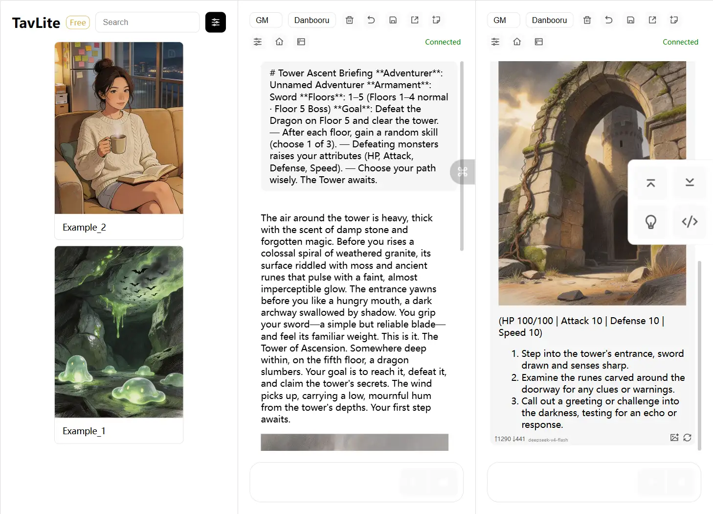

## Features

- **OpenAI-Compatible API** — Works with any LLM provider that supports the OpenAI API format
- **Streaming Chat** — Real-time SSE streaming with Markdown rendering and thinking process display
- **Multiple Conversation Modes** — Choose from GM (Game Master), NPC, or Novel mode for different storytelling styles
- **Character Card Management** — Create, edit, import, and export character cards; supports SillyTavern PNG card import
- **Text-to-Image Generation** — Integrates with ComfyUI for AI image generation (ZIT, SDXL, and Anima models)
- **Mobile-Friendly** — Responsive design for both desktop and mobile; access via `tavlite.local` through mDNS
- **Light & Dark Themes** — Switch between light and dark mode with persistent preference
- **Conversation History** — Auto-save chat history per character card
- **System Tray** — Runs quietly in the background with quick-access menu
- **QR Code Sharing** — Scan a QR code from your phone to instantly access the chat interface on mobile

## Logo


## Screenshots

### Configurable Settings

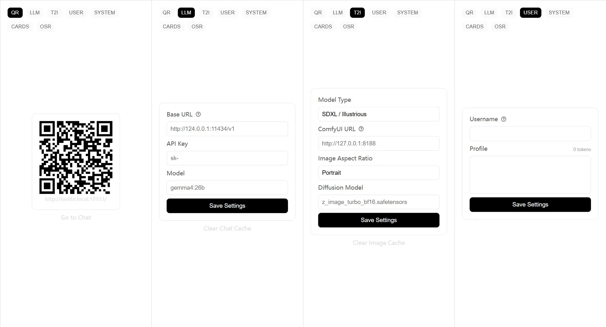

### Character Card Management & Editing

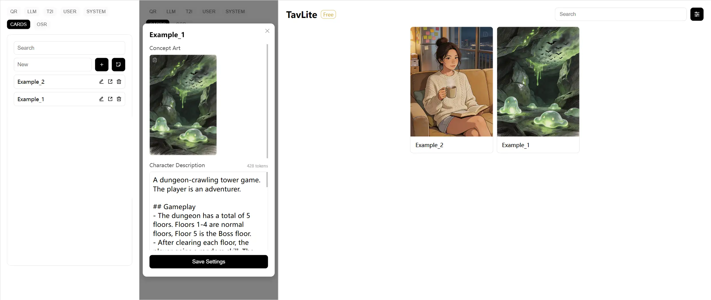

### Streaming Chat with Markdown & Theme Switching

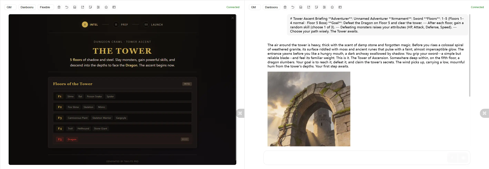

## Installation

### Method 1: Install using the package

Download the latest installer from the [Releases page](https://github.com/Karasukaigan/TavLite/releases) and install it locally.

### Method 2: Deploy from source

```bash
git clone https://github.com/Karasukaigan/TavLite.git
cd TavLite

python -m venv venv
.\venv\Scripts\activate
pip install -r requirements.txt

python server.py
```

> Note: Please deploy TavLite within a trusted local area network. Do not deploy TavLite on public cloud servers.

## TavLite Pro

[TavLite Pro](https://beyondblackwall.com/product/2) builds on everything above with additional features designed for serious character card creators and immersive RP enthusiasts:

* **Custom Tags** — Organize and filter character cards with custom tags for quick searching.
   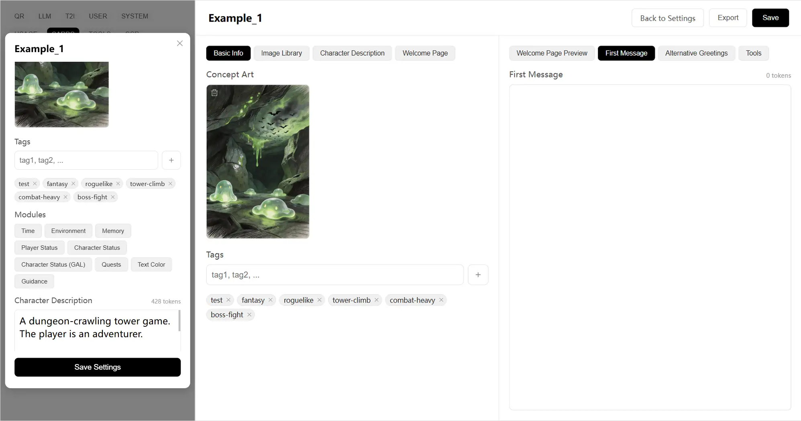
* **Image Library** — Upload multiple images with descriptions. The AI inserts them into conversations at the right moments — perfect for event CGs and visual storytelling.
   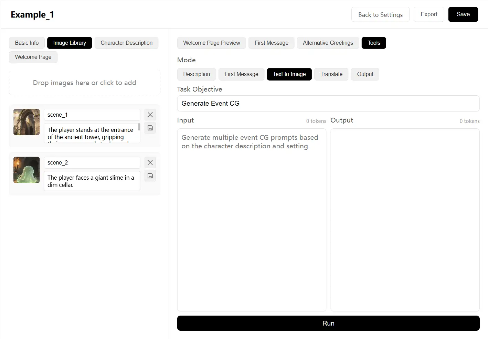
* **Module Presets & Custom Modules** — Add structured features like time tracking, character stats, and status displays to your cards with one click.
   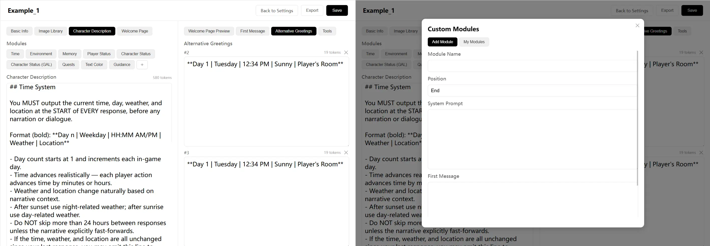
* **Card Authoring Assistant** — AI-powered tools for description polishing, opening message generation, text-to-image prompt creation, tag generation, and translation.
   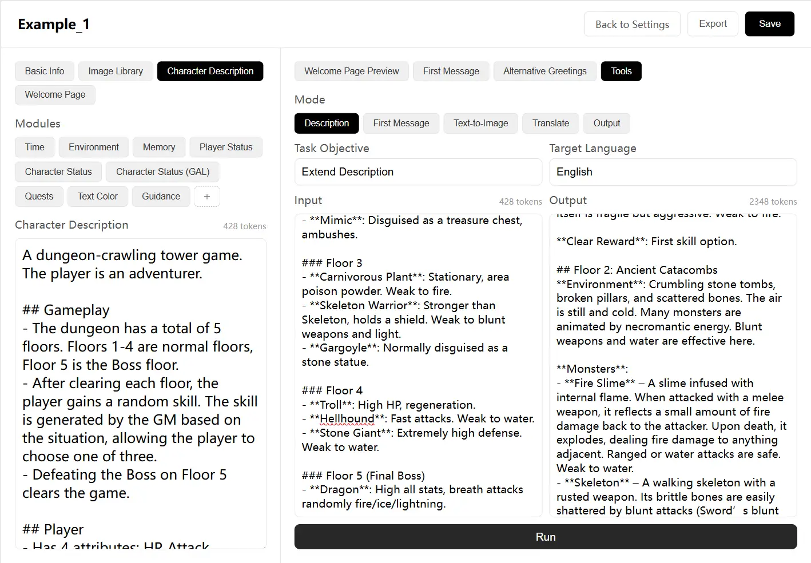
* **Welcome Page** — Attach custom HTML pages to character cards for introductions, game rules, persona setup, and interactive openings — with AI-assisted generation.
   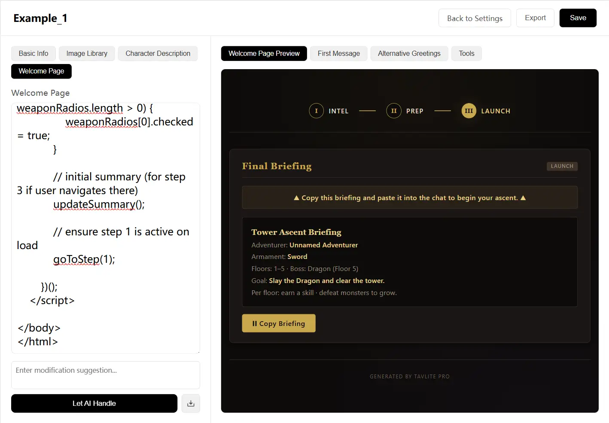
* **Usage Statistics** — Track your token consumption per model with visual charts, updated in real time.
   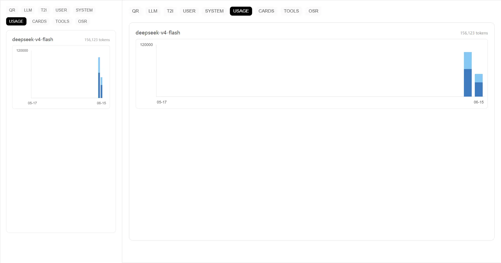
* **Privacy & Security** — Password protection and HTTPS encryption to keep your conversations private.
   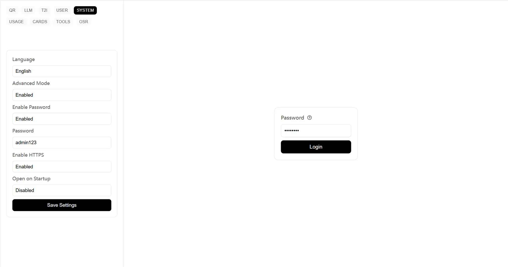

Your purchase directly supports the ongoing development of TavLite. Thank you!

## Contributing

[Issues](https://github.com/Karasukaigan/TavLite/issues) and [Pull Requests](https://github.com/Karasukaigan/TavLite/pulls) are welcome to help improve this project.

## License

This project is licensed under the [MIT License](./LICENSE).
