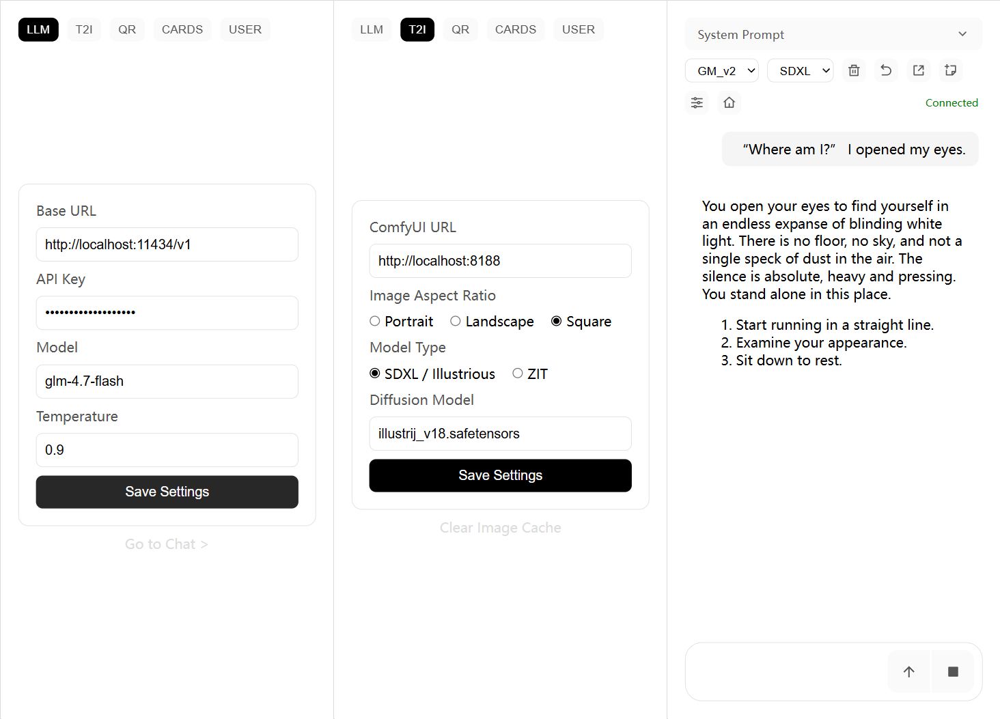
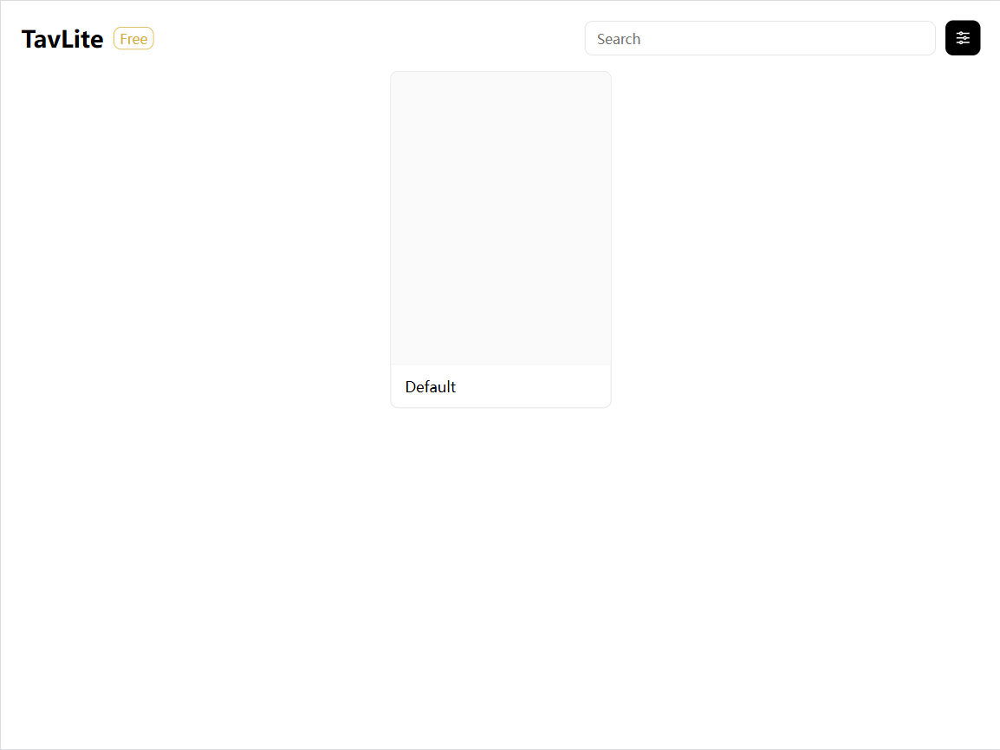
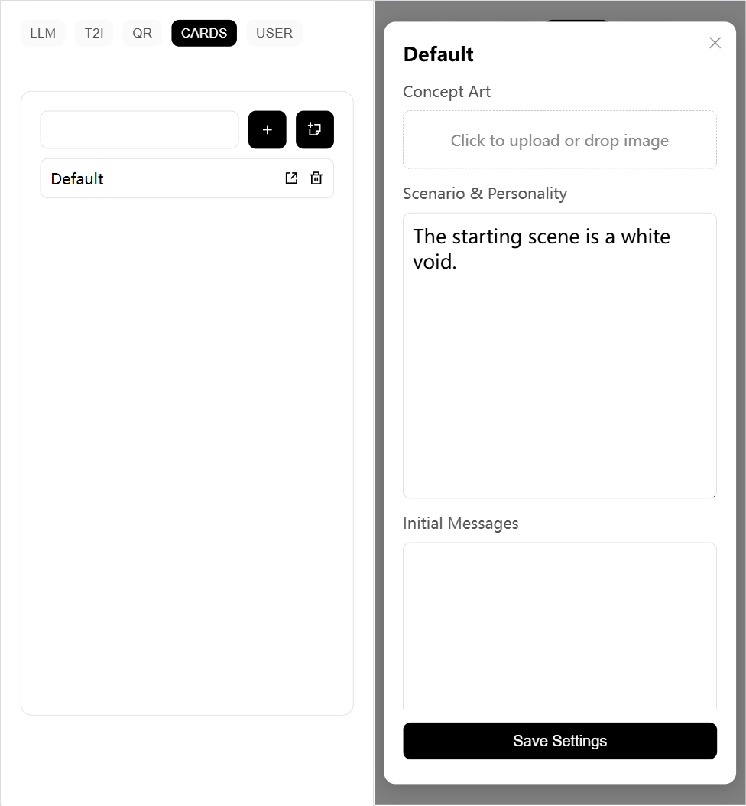

# TavLite

TavLite is an open-source local AI chat application that allows users to freely create, edit, and manage character cards, enabling a highly customizable role-playing experience.



## Features

* Compatible with most LLM APIs
* Suitable for both mobile and desktop use
* Supports integration with ComfyUI for text-to-image generation
* Character card management (create, edit, delete)
* Simpler and more lightweight than SillyTavern

## Logo


## Character Card Selection Page



## Character Card Management Page



## Installation

### Method 1: Install using the package

Download the latest installer from the [Releases page](https://github.com/Karasukaigan/TavLite/releases) and install it locally.

### Method 2: Deploy from source

```bash
git clone https://github.com/Karasukaigan/TavLite.git
cd TavLite

python -m venv venv
.\venv\Scripts\activate
pip install -r requirements.txt

python server.py
```

## Contributing

[Issues](https://github.com/Karasukaigan/TavLite/issues) and [Pull Requests](https://github.com/Karasukaigan/TavLite/pulls) are welcome to help improve this project.

## License

This project is licensed under the [MIT License](./LICENSE).